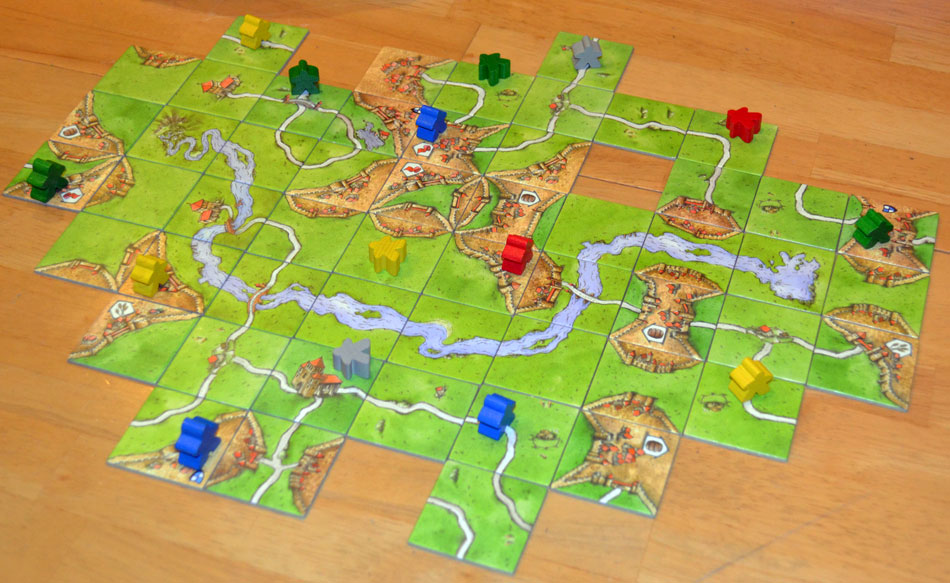

# CarcassonneCV
I love the board game Carcassonne, but often find it difficult to determine the boundries between the fields when it is time to score at the end of the game. This project takes an image of a carcassonne board and highlights it in a unique color, making scoring much simpler.

### Example Input

### Example Output

